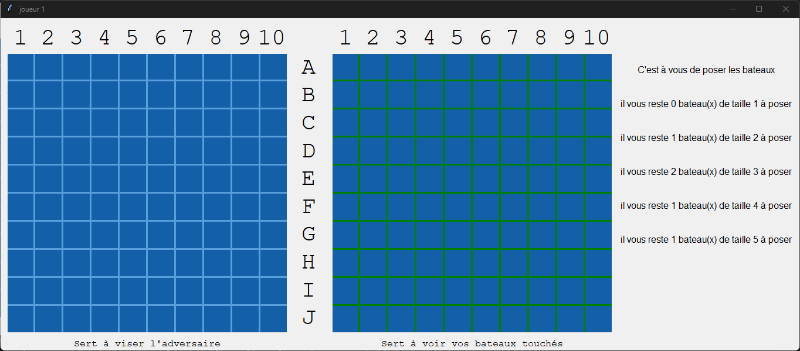

# 🛳️ Bataille Navale en Python  


<p align="center">
  <br>
  <i>Projet NSI – Un classique revisité avec Tkinter ⚓</i>
</p>

---

## 📚 Sommaire
- [🎮 Présentation](#-présentation)
- [🚀 Installation](#-installation)
- [⚙️ Fonctionnalités actuelles](#️-fonctionnalités-actuelles)
- [🧠 Fonctionnalités à venir](#-fonctionnalités-à-venir)
- [🧩 Technologies utilisées](#-technologies-utilisées)
- [💡 À propos du projet](#-à-propos-du-projet)
- [📸 Aperçu](#-aperçu)

---

## 🎮 Présentation

Bienvenue sur notre jeu **Bataille Navale**, développé en **Python** dans le cadre de notre spécialité **NSI (Numérique et Sciences Informatiques)**.  
Le jeu reprend le principe classique de la bataille navale, avec une **interface graphique** construite à l’aide du module **Tkinter**.

> 🧠 Le projet est actuellement à l’état de **prototype**, mais il est déjà **100 % fonctionnel** !

---

## 🚀 Installation

### 1️⃣ Cloner le dépôt
```bash
git clone https://github.com/maxime599/bataille-navale-tkinter.git
```

### 2️⃣ Lancer le jeu
```bash
cd bataille-navale-tkinter
python main.py
```

### 3️⃣ Jouer !
Placez vos bateaux et tentez de couler ceux de votre adversaire 💥

---

## ⚙️ Fonctionnalités actuelles

✅ Interface graphique réalisée avec **Tkinter**  
✅ Pose et suppression de bateaux  
✅ Système de tir fonctionnel  
✅ Gestion des tours de jeu  
✅ Détection automatique des bateaux coulés  

---

## 🧠 Fonctionnalités à venir

### 🖼️ Interface & Graphismes
- Images de bateaux à la place des carrés colorés ✅
- Couleur différente pour les bateaux coulés  
- Animation d’explosion lors des tirs réussis  

### 🔊 Son & Ambiance
- Voix off et effets sonores  
- Musique d’ambiance 

### 🧩 Gameplay
- Placement aléatoire des bateaux  
- Visualisation des zones interdites (`can_touch=False`)  
- Liste des bateaux restants (joueur + adversaire) avec icônes  
- Clic droit pour retirer un bateau  
- Prévisualisation du tir (croix suivant la souris pendant le tour)  
- Option pour masquer le plateau adverse  

### 🕹️ Menu & Options
- Menu principal au lancement du jeu :
  - 🎮 Jouer  
  - ⚙️ Paramètres  
  - 📜 Crédits  
- Paramètres personnalisables :
  - Nombre de bateaux  
  - Activation/désactivation du contact entre bateaux
  - Réglage du volume 

### 🌐 Multijoueur & Profils
- Connexion à distance pour jouer en ligne  
- Profils joueurs & achievements

### 📊 Gestion de profil
- Achievement/exp et quête  
- musique personnalisable
- historique des combats

---

## 🧩 Technologies utilisées

| Technologie | Description |
|--------------|-------------|
| 🐍 **Python 3.11** | Langage principal du projet |
| 🪟 **Tkinter** | Interface graphique (GUI) |
| 💾 **Git & GitHub** | Gestion de versions et collaboration |

---

## 💡 À propos du projet

Projet réalisé par des élèves de **Terminale Générale – Spécialité NSI**.  
L’objectif : apprendre à structurer un projet complet en Python, tout en explorant le développement d’interfaces graphiques.

> 🧭 Nous continuons à améliorer le jeu chaque semaine.  
> N’hésitez pas à ⭐ le projet ou à proposer vos idées via les **Issues GitHub** !

---


<p align="center">
  <b>Merci d’avoir visité notre projet 💙</b><br>
  <i>– Léo et Maxime</i>
</p>
